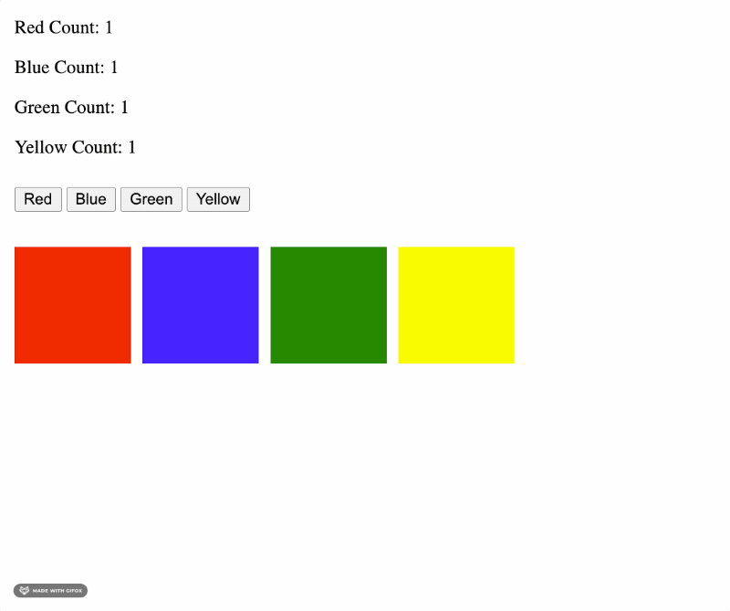

# Color Blocks 🟥 🟦 🟩 🟨 Solo Challenge

## 🔥 Important Note: 🔥

* This is a **two-part** assignment! Do not attempt Part Two until you have completed Part One!

## Assignment Objectives

We are building an application that creates color blocks on the DOM, based on button clicks. When a user clicks on a color button, it will create a color block of that color. When a user clicks on a given color block, it will be deleted from the DOM.

- Practice Read and Write skills
- Dynamic Content
  - Content that is **rendered/removed/manipulated** using javascript
- Solidify JavaScript Dom Manipulation knowledge (Examples)
  - Accessing the DOM
    - `.document.<SOME_SELECTOR>`
    - Selectors
      - `.querySelector()`
      - `.getElementById()`
      - `.getElementsByClassName()`
  - Dom Manipulation Methods
    - `.remove()`
  - Manipulation of DOM elements w/props
    - `.value = 'someValue'`
    - `.innerHTML += (<html>) `
    - `.textContent = 'someValue'`
    - `.className = 'someClass'`

👉🏽 Use the official documentation for manipulating the DOM with JavaScript as a resource: [https://developer.mozilla.org/en-US/docs/Web/API/Document](https://developer.mozilla.org/en-US/docs/Web/API/Document)

## Required Functionality for Part One!

You are provided with 4 buttons that read 'Red', 'Blue', 'Green', and 'Yellow'.

When you **click on a button**, it should:
- Add a color block of that color to the DOM.

Additionally, when you **click on a color block**, it should:
- Remove that block from the DOM

## Required Functionality for Part Two!

* Disable the deleting of color blocks: In `script.js`, comment out the necessary code.
* Uncomment the `<header>` element in `index.html`.
* Make it so that every time you append a color block, that block's corresponding color counter is updated, like so:
  

### Existing HTML and CSS

Take a minute to look through the existing HTML code, and understand what each element does:

- Which buttons will you need to attach click event handlers to?
- How will you render blocks of different colors?
- Where will the block counts be rendered?

## Stretch Goal

* Re-enable the ability to delete color blocks.
* Make it so that when you delete one of the color blocks, you also **update the corresponding color count**.

---

## Reflections

* *Optional Friday Morning Activity*

Please wait to start reflections until you've heard from your instructor.

In groups of 2 or 3, take some time to reflect and discuss your code.

Start with a "human" check-in:

* How are feeling after your first four days of this intense, immersive experience?
* How are you feeling about the JS content so far?
  * Where do you see evidence of increasing clarity? What's feeling a little fuzzy or out of focus?

Then, take turns sharing your code. The goal here is to practice talking about code with your peers, especially using the vocabulary of *expressions* and *values*. Do not simply fix each other's code.

* What was your approach to getting started on this project? Did you do some planning/note-taking, or did you jump right in?
* Describe your code in a few sentences: What strategy does your code take in solving the challenge?
* Try to not just read your code out loud: Talk through it conceptually!

If you or your partner have bugs in your code, or did not finish the project:

* **Describe**: What is your app currently doing? What do you want it to be doing?
* **Isolate**: Which parts of your code work? At what point does it break? Can you point to the exact line?
* **Fix**: What approach would you take to fix the code. What tools would you use? Use your words to explain your thinking, do not solve the code for your partner.

Lastly, please remember: Coding is hard! Also, **you just learned how to manipulate the dom with JS yesterday**. (Whoa.)

* Keep *showing up authentically* and *exposing your ignorance*. In the face of increasing complexity, these behaviors are the path to growth and clarity. (Take a look at some code you wrote a few weeks ago if you'd like to see some evidence of this growth. 🙂)
